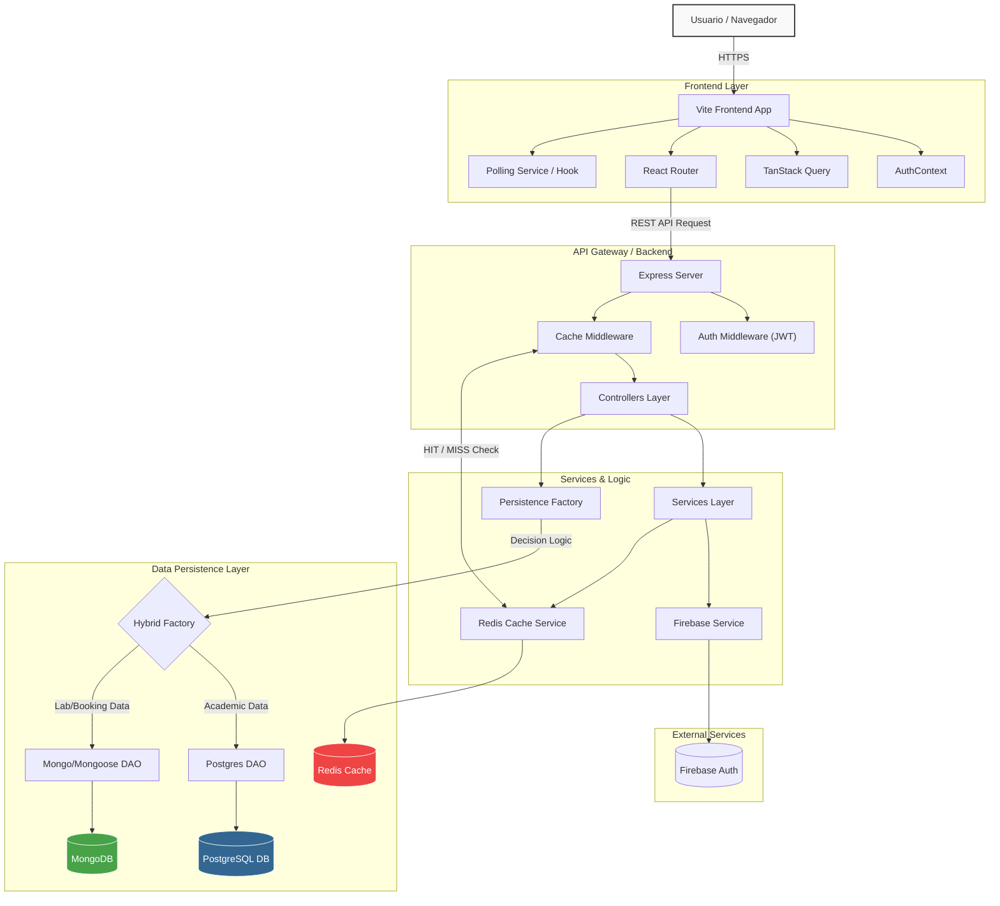

# 🏗️ Arquitectura Completa del Sistema

Este diagrama detalla la infraestructura y el flujo de datos del **Sistema de Gestión de Laboratorios**, integrando todas las capas de persistencia, caché y monitoreo.

## 🗺️ Diagrama de Arquitectura Detallado

Este diagrama refleja la estructura de diseño basada en patrones de persistencia (DAO/Factory) e integra la nueva capa de caché.

## 📋 Descripción de la Estructura "Lo Nuevo"

### 🛡️ Capa de Intercepción (Caché)
Se ha integrado el **Cache Middleware** justo después de la autenticación. Este componente es el encargado de consultar al **Redis Cache Service** antes de permitir que la petición llegue a los controladores, reduciendo drásticamente la latencia.

### 🏭 Factoría Híbrida
La persistencia sigue una lógica de **Hybrid Factory**:
*   **Postgres DAO**: Maneja entidades relacionales (estudiantes, docentes, facultades).
*   **Mongo/Mongoose DAO**: Maneja las entidades dinámicas como reportes y las reservas de laboratorios que ahora cuentan con aceleración por caché.

### 🔄 Sincronización de Datos
El **Polling Service** en el frontend solicita actualizaciones frecuentes (Dashboard), las cuales son servidas mayoritariamente desde el **RedisDB** gracias a la lógica de **HIT/MISS** implementada en el middleware.

## 📋 Componentes Clave

### 1. Frontend (React + Vite)
*   **Tecnologías**: React 18, Tailwind CSS, Recharts.
*   **Funcionalidad**: Interfaz administrativa moderna con dashboards en tiempo real y gestión de reservas.
*   **Comunicación**: Polling optimizado cada 2 segundos hacia el backend.

### 2. Backend (Node.js + Express)
*   **Seguridad**: Autenticación vía JWT y Firebase Admin (para notificaciones/auth).
*   **Gestión de Datos**: Implementación del patrón de "Caché de Lectura" mediante un middleware personalizado.

### 3. Capa de Caché (Redis)
*   **Propósito**: Reducción del 90%+ de la carga en base de datos.
*   **Configuración**: Persistencia AOF activa y TTLs dinámicos (5s-30s) según el tipo de dato.

### 4. Persistencia Políglota
*   **PostgreSQL**: Datos estructurados (Usuarios, Carreras, Facultades).
*   **MongoDB**: Datos dinámicos y de alto volumen (Reservas, Reportes, Historial).

### 5. Docker Orchestration
*   Todo el ecosistema corre en una red aislada (`gestor_lab_network`), asegurando que solo sean accesibles los puertos necesarios (3000, 5173, 8082, etc.).

---
> [!NOTE]
> Backblaze ha sido excluido de este diagrama según lo solicitado, enfocándonos exclusivamente en la infraestructura local y de base de datos.
