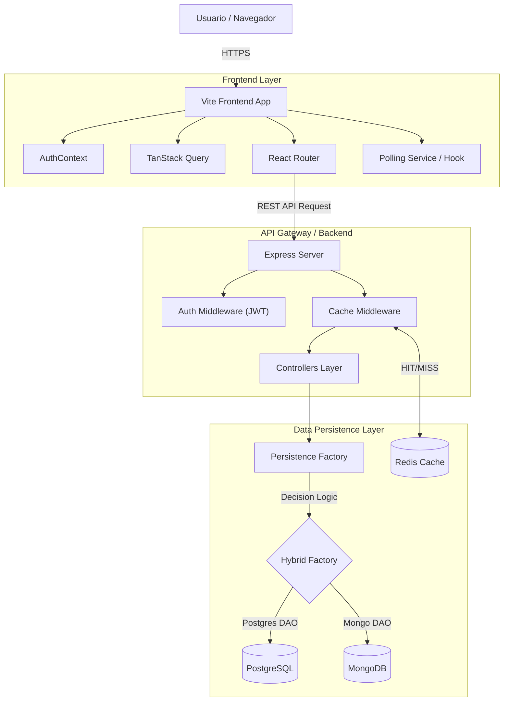
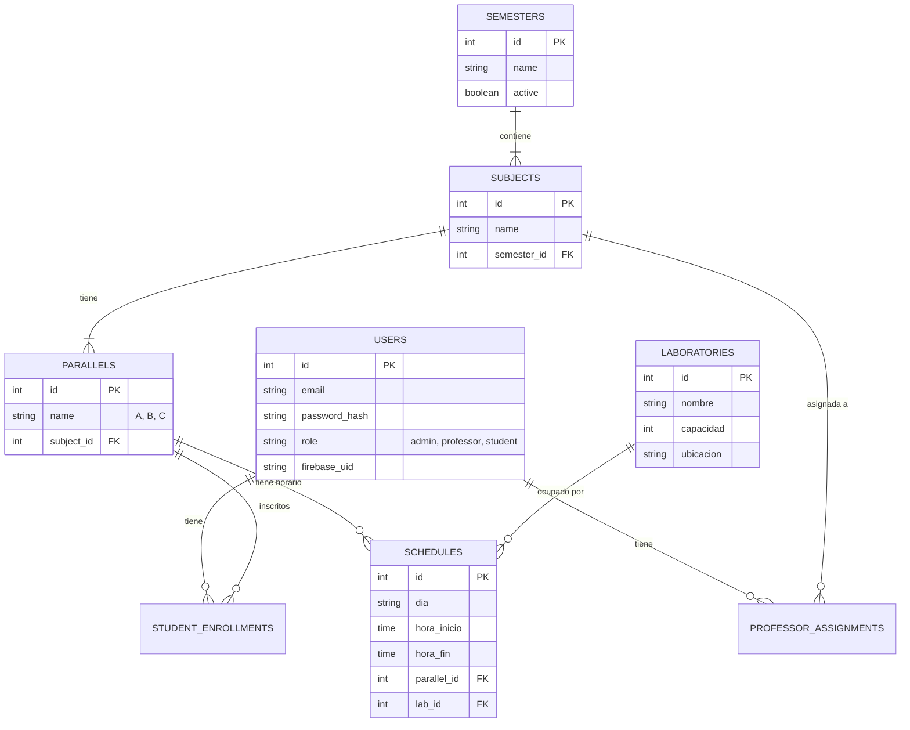
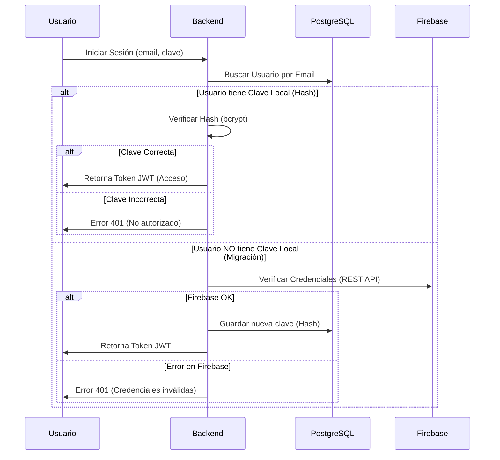

<div align="center">
  
  <h1>Sistema de Gestión de Laboratorios</h1>
  <h3>Facultad de Ingeniería</h3>
</div>

<div align="center">

  
  
  
  
  
  <br/>

  
  
  
  

</div>

<br/>

<br/>

Este proyecto es un sistema integral para la gestión, reserva y administración de laboratorios de computación de la Facultad. Permite a estudiantes y profesores reservar espacios, y a los administradores gestionar la carga académica, horarios y usuarios.

## 🚀 Características Principales

*   **Gestión de Reservas**: Interfaz visual para reservar laboratorios por horas.
*   **Roles de Usuario**:
    *   **Estudiante**: Puede reservar laboratorios para práctica libre.
    *   **Profesor**: Tiene prioridad en reservas y puede asignar reservas a sus materias.
    *   **Administrador**: Gestión total de usuarios, laboratorios, horarios y reservas.
*   **Gestión Académica**: Control de Semestres, Asignaturas, Paralelos y Carga Horaria.
*   **Validación de Conflictos**: Sistema inteligente que evita solapamiento de reservas y horarios de clase.
*   **Sistema de Mensajería Interna**: Chat en tiempo real con historial persistente (MongoDB) para la comunicación entre profesores, estudiantes y administradores. Incluye notificaciones de mensajes no leídos y ordenamiento inteligente.
*   **Autenticación Híbrida**: Sincronización entre Firebase Auth y base de datos local PostgreSQL.

## 🛠️ Stack Tecnológico

*   **Frontend**: React + Vite (Javascript), TailwindCSS, ShadcnUI, Lucide Icons.
*   **Backend**: Node.js + Express.
*   **Caché**: Redis 7 (In-memory storage para Dashboard y Reservas).
*   **Base de Datos Relacional**: PostgreSQL (Usuarios, Académico, Laboratorios, Horarios).
*   **Base de Datos No Relacional**: MongoDB (Reservas - Histórico y Mensajería).
*   **Autenticación**: Firebase Auth + JWT.
*   **Infraestructura**: Docker & Docker Compose.

---

El sistema utiliza un diseño basado en patrones **DAO (Data Access Object)** y una **Factoría Híbrida** para gestionar la persistencia políglota, optimizada con una capa de caché de alto rendimiento.



---

## 💾 Bases de Datos

El sistema utiliza un enfoque híbrido para aprovechar las fortalezas de SQL y NoSQL.

### 1. PostgreSQL (Core & Académico)
Maneja la integridad referencial fuerte requerida para la estructura académica y usuarios.

#### Diagrama E-R (Entidad-Relación)



### 2. MongoDB (Reservas)
Maneja las transacciones de reservas, permitiendo flexibilidad y rapidez en consultas de rangos de fechas.

**Colección: `reservas`**

| Campo | Tipo | Descripción |
| :--- | :--- | :--- |
| `_id` | ObjectId | Identificador único |
| `userId` | String | ID del usuario (Postgres ID) |
| `nombre` | String | Nombre del usuario (Caché visual) |
| `laboratorio` | String | Nombre del laboratorio |
| `fecha` | String | Formato YYYY-MM-DD |
| `horaInicio` | String | Formato HH:mm |
| `horaFin` | String | Formato HH:mm |

### 3. Redis (Caché de Rendimiento)
Utilizado para acelerar el Dashboard Administrativo y las consultas frecuentes de disponibilidad mediante:
- **Middleware de Caché**: Intercepción de rutas GET.
- **Polling Optimization**: Soporta actualizaciones cada 2s con mínimo impacto en DB.
- **TTLs Dinámicos**: Entre 5 y 30 segundos según la volatilidad del dato.

---

## 🔐 Flujo de Autenticación Híbrido

Implementamos una estrategia de "Lazy Migration" para soportar usuarios legados de Firebase y nuevos usuarios nativos.



---

## 🔄 Flujos de Trabajo Principales

### 1. Reserva de Laboratorio

1.  **Selección**: El usuario selecciona un laboratorio desde el **Catálogo**.
2.  **Formulario**: Ingresa fecha, hora y motivo.
    *   *Profesores*: Pueden seleccionar una de sus materias asignadas.
    *   *Estudiantes*: Reserva personal.
3.  **Validación**:
    *   ¿El laboratorio está abierto?
    *   ¿Ya existe una reserva en ese horario?
    *   ¿Hay conflicto con una clase regular (Schedule)?
    *   **Prioridad 10min**: Si un profesor intenta reservar sobre un estudiante y la reserva del estudiante tiene < 10 mins, el profesor puede reclamar el turno.
4.  **Confirmación**: Se guarda en MongoDB y se notifica al usuario.

4.  **Confirmación**: Se guarda en MongoDB y se notifica al usuario.

### 2. Comunicación Institucional (Chat)

1.  **Listado de Contactos**: Se muestran usuarios relevantes según el rol (Profesores ven estudiantes, etc.).
2.  **Sondeo Inteligente**: El sistema actualiza automáticamente los mensajes no leídos y reordena la lista de contactos para dar prioridad a las conversaciones activas.
3.  **Persistencia**: Todo el historial de chat se almacena en MongoDB (`messages` collection), garantizando que no se pierdan datos entre sesiones.
4.  **Sincronización**: Control de estado de lectura para notificar al remitente cuando su mensaje ha sido visto.

### 3. Gestión Académica (Admin)

1.  **Carga de Datos**: El administrador crea Semestres, Materias y Paralelos.
2.  **Asignación Docente**: Asigna profesores a materias específicas.
3.  **Matriculación**: Asigna estudiantes a paralelos (Semestre).
4.  **Generación de Horarios**: Define horarios fijos (Clases) en la tabla `schedules`.
5.  **Generación Masiva**: El sistema puede generar automáticamente las reservas en MongoDB para todo el semestre basándose en los `schedules`.

---

## 👥 Roles del Sistema

| Rol | Permisos |
| :--- | :--- |
| **Admin** | Acceso total. Crear/Editar/Eliminar laboratorios, usuarios, materias, horarios. Puede borrar cualquier reserva. |
| **Profesor** | Reservar con prioridad. Ver sus materias. Reclamar turnos de estudiantes recientes. |
| **Estudiante** | Reservar turnos libres. Ver sus materias inscritas. Solo puede borrar sus propias reservas. |

---

## 💻 Instalación y Despliegue

### Requisitos Previos
*   Docker & Docker Compose
*   Node.js v18+ (para desarrollo local sin Docker)

### Pasos para Ejecutar

1.  **Clonar el repositorio**
    ```bash
    git clone https://github.com/BryanS1996/Sistema_Laboratorios_Arqui.git
    cd Sistema_Laboratorios_Arqui
    ```

2.  **Configurar Variables de Entorno**
    *   Copiar `backend/.env.example` a `backend/.env` y configurar credenciales de DB y Firebase.
    *   Copiar `frontend/.env.example` a `frontend/.env`.

3.  **Iniciar con Docker Compose**
    ```bash
    docker-compose up --build
    ```
    Esto levantará:
    *   Backend en puerto `3000`
    *   Frontend en puerto `5173`
    *   Postgres en puerto `5432`
    *   MongoDB en puerto `27017`
    *   Redis en puerto `6379`
    *   Redis Commander en puerto `8082` (Web UI para Caché)
    *   Mongo Express en puerto `8081` (Interfaz Mongo)
    *   pgAdmin en puerto `5050` (Interfaz Postgres)

### 🔄 Restauración Automática de Base de Datos

El sistema está configurado para restaurar automáticamente el archivo `backend/sql/academico.sql` al iniciar el contenedor de PostgreSQL **por primera vez**.

Si deseas reiniciar la base de datos con estos datos:
1.  Detén los contenedores y borra los volúmenes:
    ```bash
    docker-compose down -v
    ```
2.  Inicia nuevamente:
    ```bash
    docker-compose up --build
    ```
Esto ejecutará el script `academico.sql` después de la inicialización básica.

### Scripts de Utilidad (Backend)

Ubicados en `backend/scripts/`:
*   `create_admin_fixed.js`: Crea/Restablece un usuario administrador.
*   `check_users.js`: Lista usuarios en la base de datos local.
*   `seed_reservations.js`: Genera datos de prueba para reservas.

---

## 📁 Estructura del Proyecto

```
/
├── backend/
│   ├── src/
│   │   ├── controllers/   # Lógica de entrada/salida
│   │   ├── services/      # Lógica de negocio
│   │   ├── daos/          # Acceso a datos (Postgres/Mongo)
│   │   ├── models/        # Modelos Mongoose
│   │   └── routes/        # Definición de endpoints
│   ├── sql/               # Scripts de migración SQL
│   └── scripts/           # Scripts de mantenimiento
├── frontend/
│   ├── src/
│   │   ├── components/    # Componentes Reutilizables
│   │   ├── pages/         # Vistas principales
│   │   ├── context/       # Estado global (Auth)
│   │   └── lib/           # Utilidades y API
└── docker-compose.yml
```
