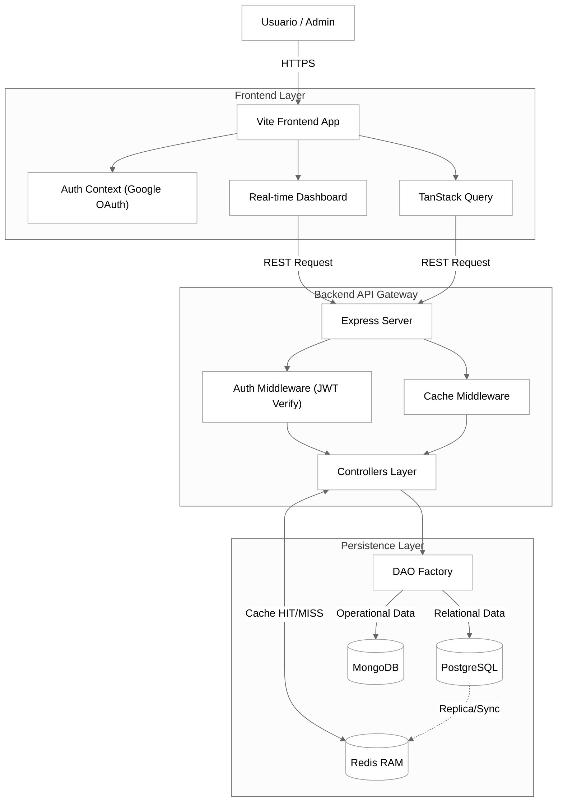
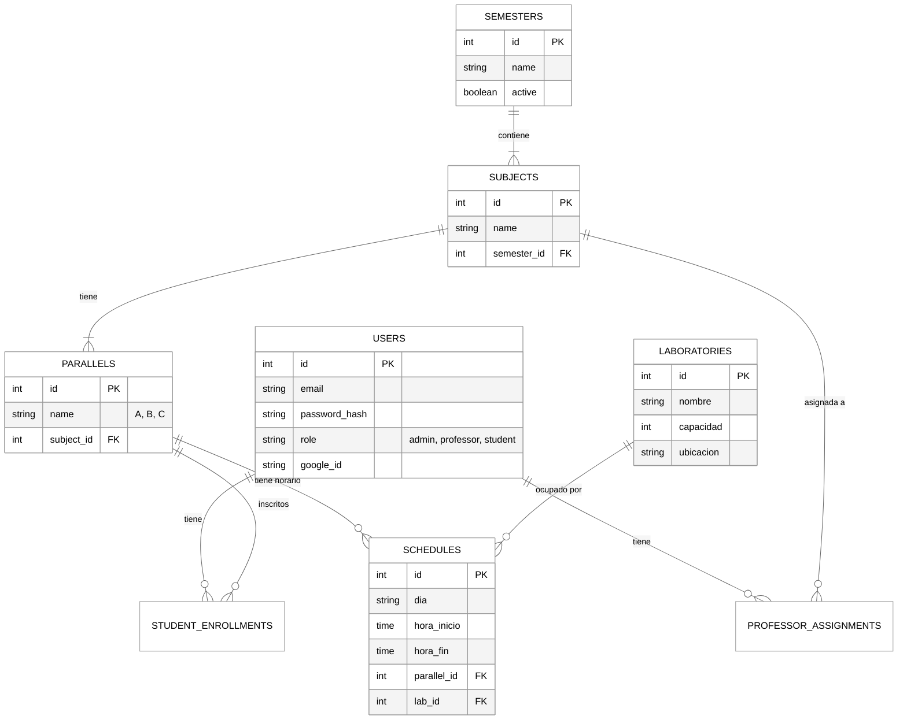
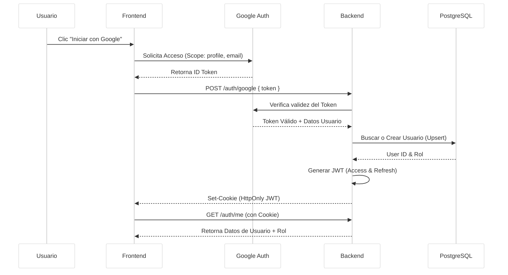

<div align="center">
  
  <h1>Sistema de Gestión de Laboratorios</h1>
  <h3>Facultad de Ingeniería</h3>
</div>

<div align="center">

  
  
  
  
  
  <br/>

  
  
  
  
  

</div>

<br/>

Este proyecto es un sistema integral para la gestión, reserva y administración de laboratorios de computación de la Facultad. Implementa una arquitectura moderna, híbrida y resiliente, diseñada para soportar alta concurrencia y gestión académica compleja.

## 🚀 Características Principales

*   **Gestión de Reservas Inteligente**: Sistema de reservas validado con reglas de negocio complejas (prioridad profesor/estudiante, regla de los 10 minutos, conflictos de horario).
*   **Roles de Usuario**:
    *   **Estudiante**: Reservas de práctica libre.
    *   **Profesor**: Prioridad en reservas y asignación a materias.
    *   **Administrador**: Control total del sistema.
*   **Gestión Académica**: Control de Semestres, Materias, Paralelos y Carga Horaria.
*   **Dashboard de Logs en Tiempo Real**: Monitorización de actividad administrativa usando **Redis Pub/Sub** y WebSockets/Polling.
*   **Resiliencia**: Sistema capaz de operar en modo degradado (lectura de caché Redis) si la base de datos principal (Postgres) falla.
*   **Autenticación Robusta**: **Google OAuth** con gestión de sesiones segura mediante JWT en Cookies HttpOnly.

## 🛠️ Stack Tecnológico

*   **Frontend**: React + Vite + TailwindCSS (ShadcnUI, Lucide Icons).
*   **Backend**: Node.js + Express.
*   **Bases de Datos**:
    *   **PostgreSQL**: Datos relacionales (Usuarios, Roles, Académico, Auditoría Permanente).
    *   **MongoDB**: Datos operativos volátiles (Reservas, Historial de Chat).
    *   **Redis**: Capa de Caché, Colas de Logs Recientes y Pub/Sub para tiempo real.
*   **Autenticación**: Google OAuth 2.0 + JWT (Access Token + Refresh Token).
*   **Infraestructura**: Docker Compose (Contenedores para App, DBs y herramientas de gestión).

---

## 🏗️ Arquitectura del Sistema

El sistema utiliza un diseño basado en patrones **DAO (Data Access Object)** y persistencia políglota, optimizada con una capa de caché de alto rendimiento.



---

## 💾 Bases de Datos

El sistema utiliza un enfoque híbrido para aprovechar las fortalezas de SQL y NoSQL.

### 1. PostgreSQL (Core & Académico)
Maneja la integridad referencial fuerte requerida para la estructura académica y usuarios.

#### Diagrama E-R (Entidad-Relación)



### 2. MongoDB (Reservas)
Maneja las transacciones de reservas, permitiendo flexibilidad y rapidez en consultas de rangos de fechas.

**Colección: `reservas`**

| Campo | Tipo | Descripción |
| :--- | :--- | :--- |
| `_id` | ObjectId | Identificador único |
| `userId` | String | ID del usuario (Postgres ID) |
| `nombre` | String | Nombre del usuario (Caché visual) |
| `laboratorio` | String | Nombre del laboratorio |
| `fecha` | String | Formato YYYY-MM-DD |
| `horaInicio` | String | Formato HH:mm |
| `horaFin` | String | Formato HH:mm |

### 3. Redis (Caché de Rendimiento)
Utilizado para acelerar el Dashboard Administrativo y las consultas frecuentes de disponibilidad mediante:
- **Middleware de Caché**: Intercepción de rutas GET.
- **Polling Optimization**: Soporta actualizaciones cada 2s con mínimo impacto en DB.
- **TTLs Dinámicos**: Entre 5 y 30 segundos según la volatilidad del dato.

---

## 🔐 Flujo de Autenticación (Google OAuth)

El sistema ha eliminado Firebase en favor de una autenticación nativa con Google OAuth para mayor control y privacidad.



---

## 💾 Modelo de Datos Híbrido

### 1. PostgreSQL (Estructura y Seguridad)
*   **Tablas**: `users`, `audit_logs`, `semesters`, `subjects`, `parallels`, `schedules`.
*   **Función**: Garantiza la integridad referencial de la carga académica y la seguridad de los usuarios.

### 2. MongoDB (Flexibilidad Operativa)
*   **Colecciones**: `reservas`, `laboratorios`, `chat_messages`.
*   **Función**: Permite consultas complejas de rangos de fechas para reservas y almacenamiento de mensajes de chat.

### 3. Redis (Velocidad y Tiempo Real)
*   **Estructuras**:
    *   `recent_audit_logs` (List): Últimos 100 eventos para el dashboard.
    *   `reservas:date` (Key-Value): Caché de disponibilidad.
*   **Función**: Provee respuestas en <10ms para dashboards y reduce carga en bases de datos.

---

## 💻 Instalación y Despliegue

### Requisitos Previos
*   Docker & Docker Compose

### Pasos para Ejecutar

1.  **Clonar el repositorio**
    ```bash
    git clone https://github.com/BryanS1996/Sistema_Laboratorios_Arqui.git
    cd Sistema_Laboratorios_Arqui
    ```

2.  **Configurar Entorno**
    *   Asegúrate de tener los archivos `.env` en `backend/` y `frontend/` (ver `.env.example`).
    *   **Importante**: Necesitas credenciales de Google OAuth (Client ID).

3.  **Iniciar con Docker Compose**
    ```bash
    docker-compose up --build -d
    ```
    
    Servicios disponibles:
    *   **Frontend**: http://localhost:5173
    *   **Backend**: http://localhost:3000
    *   **Mongo Express**: http://localhost:8081
    *   **Redis Commander**: http://localhost:8082
    *   **pgAdmin**: http://localhost:5050

### 🧪 Ejecución de Tests (Resiliencia)

Este proyecto incluye una suite de pruebas de estrés con **k6** para verificar la robustez del sistema y el funcionamiento del caché Redis.

Para ejecutar los tests de estrés y ver el dashboard de métricas:

```powershell
# Ejecutar test de logs y resiliencia
k6 run stress_test_logs_fullstack.js
```

Para probar la **resiliencia** (caída de base de datos):
1.  Inicia el test k6.
2.  En otra terminal: `docker stop gestor_lab_postgres`.
3.  Verifica en http://localhost:5173/admin/logs que el sistema sigue funcionando (gracias a Redis).
4.  Restaura la base de datos: `docker start gestor_lab_postgres`.
