<div align="center">
  
  <h1>Sistema de Gestión de Laboratorios 🏫</h1>
  <h3>Facultad de Ingeniería - Universidad Central del Ecuador</h3>
  <p><em>"Optimizando la Gestión Académica del Laboratorio"</em></p>
</div>

<div align="center">

  
  
  
  
  
  <br/>

  
  
  
  
  
  <br>
  
  [](badges)
  [](LICENSE)
  [](releases)

</div>

---

## 📋 Descripción General

Sistema integral para la **gestión, reserva y administración de laboratorios** de la Facultad de Ingeniería. Implementa una arquitectura moderna, resiliente y escalable con soporte para alta concurrencia, gestión académica compleja y monitoreo en tiempo real.

### ✨ Características Principales

- ✅ **Gestión Inteligente de Reservas** - Sistema validado con reglas de negocio complejas
  - Prioridad Profesor > Estudiante
  - Consolidación de reservas (10 minutos)
  - Detección automática de conflictos
  
- 👥 **Roles Diferenciados**
  - **Estudiante**: Reservas de práctica libre
  - **Profesor**: Prioridad en reservas y asignación a materias
  - **Administrador**: Control total del sistema
  
- 📊 **Dashboard Admin en Tiempo Real**
  - Estadísticas de reservas
  - Top usuarios
  - Horarios populares
  - Análisis por laboratorio
  
- 🔐 **Autenticación Robusta**
  - Google OAuth 2.0
  - JWT (Access + Refresh Tokens)
  - Cookies HttpOnly seguras
  
- 🔗 **Single Sign-On (SSO)**
  - Acceso directo a dashboards especializados
  - Sin re-autenticación
  - Token seguro vía Body JSON
  
- 🚀 **Resiliencia**
  - Modo degradado con caché Redis
  - Tolerancia a fallos de base de datos
  - Recuperación automática

---

## 🏗️ Arquitectura del Sistema

### Diagrama General de Arquitectura

```mermaid
%%{init: {'theme': 'neutral', 'themeVariables': { 'primaryColor': '#1e40af', 'primaryTextColor': '#fff', 'primaryBorderColor': '#0c3699', 'lineColor': '#5b21b6', 'secondBkgColor': '#60a5fa', 'tertiaryColor': '#f0f4f8'}}}%%
graph TB
    subgraph "Clientes"
        WEB["🌐 Web Browser"]
        MOB["📱 Mobile Browser"]
    end
    
    subgraph "Frontend Layer"
        APP_A["APP A (5173)<br/>Admin Principal"]
        APP_B["APP B (5174)<br/>Dashboard Logs"]
    end
    
    subgraph "API Gateway & Middleware"
        LOAD["⚖️ Load Balancer<br/>(nginx opcional)"]
        AUTH["🔐 Auth Middleware<br/>(JWT Verify)"]
        CACHE_MW["⚡ Cache Middleware<br/>(Redis)"]
    end
    
    subgraph "Backend Logic"
        API["🎯 Express API<br/>(Puerto 3000)"]
        CONTROLLERS["📋 Controllers"]
        SERVICES["🔧 Services"]
        FACTORY["🏭 DAO Factory"]
    end
    
    subgraph "Data Layer - Persistencia Políglota"
        POSTGRES["🗄️ PostgreSQL<br/>(Datos Académicos)"]
        MONGO["🍃 MongoDB<br/>(Reservas Operativas)"]
        REDIS["⚡ Redis<br/>(Caché & Pub/Sub)"]
    end
    
    subgraph "Herramientas Admin"
        PGADMIN["📊 pgAdmin (5050)"]
        MONGO_EXP["🌳 Mongo Express (8081)"]
        REDIS_CMD["⚙️ Redis Commander (8082)"]
    end
    
    WEB -->|HTTPS| APP_A
    MOB -->|HTTPS| APP_A
    APP_A -->|SSO Token| APP_B
    APP_A -->|REST| LOAD
    APP_B -->|REST| LOAD
    
    LOAD --> AUTH
    AUTH --> CACHE_MW
    CACHE_MW --> API
    
    API --> CONTROLLERS
    CONTROLLERS --> SERVICES
    SERVICES --> FACTORY
    
    FACTORY -->|Read/Write| POSTGRES
    FACTORY -->|Read/Write| MONGO
    FACTORY -->|Get/Set| REDIS
    
    POSTGRES -.->|Sync| REDIS
    
    PGADMIN -->|Manage| POSTGRES
    MONGO_EXP -->|Manage| MONGO
    REDIS_CMD -->|Monitor| REDIS
```



### Diagrama Detallado del Flujo de Datos

```mermaid
%%{init: {'theme': 'dark', 'themeVariables': { 'primaryColor': '#1e40af', 'primaryTextColor': '#fff'}}}%%
sequenceDiagram
    participant Client as 👤 Cliente
    participant Frontend as 🌐 Frontend (React)
    participant Backend as 🎯 Backend (Express)
    participant Redis as ⚡ Redis
    participant Postgres as 🗄️ PostgreSQL
    participant Mongo as 🍃 MongoDB
    
    Client->>Frontend: 1. Solicita datos
    Frontend->>Backend: 2. GET /api/reservas (con token)
    
    Backend->>Redis: 3. ¿Existe en caché?
    alt Cache HIT
        Redis-->>Backend: 4. Retorna datos cacheados
    else Cache MISS
        Backend->>Postgres: 5. Consulta datos relacionales
        Backend->>Mongo: 6. Consulta reservas
        Postgres-->>Backend: 7. User / Roles / Academic
        Mongo-->>Backend: 8. Reservations
        Backend->>Redis: 9. Almacena en caché (TTL: 30s)
    end
    
    Backend-->>Frontend: 10. JSON Response
    Frontend-->>Client: 11. Datos procesados
```



---

## 💾 Modelo de Datos Híbrido

### PostgreSQL - Datos Relacionales & Seguros

**Tablas principales:**
| Tabla | Propósito | Relación |
|-------|----------|----------|
| `users` | Usuarios del sistema | Central |
| `roles` | Permisos y acceso | N:1 con users |
| `semesters` | Periodos académicos | Master |
| `subjects` | Materias/Asignaturas | N:1 con semesters |
| `parallels` | Paralelos (A, B, C) | N:1 con subjects |
| `professor_assignments` | Asignación de profesores | M:N users-subjects |
| `student_enrollments` | Inscripción de estudiantes | M:N users-parallels |
| `laboratories` | Laboratorios disponibles | Master |
| `audit_logs` | Registro de actividades | Auditoría |

### MongoDB - Datos Operativos & Flexibles

**Colecciones principales:**

#### `reservas` - Reserva de Laboratorio
```javascript
{
  _id: ObjectId,
  userId: "123",                      // Ref a PostgreSQL.users.id
  laboratorio: "Laboratorio de Computación 1",
  fecha: "2026-02-18",                // YYYY-MM-DD
  horaInicio: "09:00",                // HH:mm
  horaFin: "11:00",
  motivo: "Práctica de laboratorio",  // Categoría de uso
  actividad: "clase normal",           // Tipo de actividad
  subjectId: "5",                     // Ref a PostgreSQL.subjects.id
  parallelId: "12",                   // Ref a PostgreSQL.parallels.id
  createdAt: ISODate("2026-02-17T20:30:00Z"),
  updatedAt: ISODate("2026-02-17T20:30:00Z")
}
```

#### `laboratorios` - Laboratorios Disponibles
```javascript
{
  _id: ObjectId,
  nombre: "Laboratorio de Computación 1",
  capacidad: 30,
  ubicacion: "Edificio A - Aula 305",
  slots: [
    { startTime: "07:00", endTime: "09:00" },
    { startTime: "09:00", endTime: "11:00" },
    // ... más horarios
  ],
  equipamiento: ["Proyector", "PCs i7", "Pizarra Inteligente"],
  estado: "activo"
}
```

### Redis - Caché & Tiempo Real

**Estructuras de datos:**

```
Clave: "reservas:2026-02-18" → List de reservas del día
Clave: "lab:availability:Lab1" → Set de horarios disponibles
Clave: "user:dashboard:{userId}" → Cache del dashboard de usuario
Clave: "recent_audit_logs" → Últimas 100 acciones administrativas

TTL: 
  - Disponibilidad: 30 segundos
  - Dashboard: 60 segundos
  - Logs: 5 minutos
```

---

## 🔐 Autenticación y Seguridad

### Flujo de Google OAuth

```mermaid
%%{init: {'theme': 'light'}}%%
sequenceDiagram
    participant User as 👤 Usuario
    participant Frontend as 🌐 Frontend
    participant Google as 🔒 Google OAuth
    participant Backend as 🎯 Backend
    participant Database as 🗄️ PostgreSQL
    
    User->>Frontend: 1. Clic "Iniciar con Google"
    Frontend->>Google: 2. Abre popup de Google
    User->>Google: 3. Ingresa credenciales
    Google-->>Frontend: 4. Retorna ID Token
    
    Frontend->>Backend: 5. POST /auth/google { idToken }
    Backend->>Google: 6. Verifica Token
    Google-->>Backend: 7. Token Válido + Datos Usuario
    
    Backend->>Database: 8. Buscar/Crear Usuario (Upsert)
    Database-->>Backend: 9. User ID, Role, Email
    
    Backend->>Backend: 10. Genera JWT Tokens
    Note over Backend: Access Token (30m)<br/>Refresh Token (30d)
    
    Backend-->>Frontend: 11. { accessToken, user, role }
    Frontend->>Frontend: 12. localStorage.setItem('accessToken', token)
    Frontend-->>User: 13. ✅ Autenticado - Redirige a Dashboard
```



### Estructura del JWT

**Access Token (JWT):**
```javascript
{
  "header": {
    "alg": "HS256",
    "typ": "JWT"
  },
  "payload": {
    "id": "1",
    "email": "admin@example.com",
    "role": "admin",
    "iat": 1708195200,
    "exp": 1708196800  // 30 minutos
  }
  // Signature: HS256(header + payload + SECRET)
}
```

### Almacenamiento Seguro

| Token | Almacenamiento | Ventajas | Desventajas |
|-------|----------------|----------|------------|
| **Access Token** | localStorage | Disponible en AJAX | Vulnerable a XSS |
| **Refresh Token** | Cookie HttpOnly | Seguro (HTTP-only) | No accesible en JS |

**Protecciones implementadas:**
- ✅ Cookie HttpOnly (no accesible desde JS)
- ✅ CORS configurado (solo dominios autorizados)
- ✅ CSRF tokens incluidos
- ✅ HTTPS en producción
- ✅ Expiración automática de tokens

---

## 🔗 Single Sign-On (SSO) - Arquitectura Unificada

### Topología de Aplicaciones

```mermaid
graph LR
    subgraph "Frontend Instances"
        appA["APP A - Panel Admin<br/>Puerto 5173"]
        appB["APP B - Dashboard Logs<br/>Puerto 5174"]
    end
    
    subgraph "Backend Shared"
        backend["Backend Express<br/>Puerto 3000"]
        jwtSecret["JWT_SECRET<br/>Compartido"]
    end
    
    subgraph "Databases"
        postgres["PostgreSQL<br/>Users & Auth"]
        mongo["MongoDB<br/>Audit Logs"]
    end
    
    appA-->|POST /auth/login| backend
    appA-->|Abre en nueva pestaña<br/>+ Token en URL| appB
    appB-->|POST /api/logs/sso<br/>Body: {token}| backend
    
    appA -->|Token en localStorage| jwtSecret
    appB -->|Lee token de URL| jwtSecret
    
    backend -->|Valida JWT| jwtSecret
    backend -->|Read/Write| postgres
    backend -->|Read| mongo
```

### Flujo Completo de SSO

```mermaid
%%{init: {'theme': 'light'}}%%
sequenceDiagram
    participant U as Usuario
    participant A as APP A<br/>5173
    participant B as APP B<br/>5174
    participant BK as Backend<br/>3000
    
    rect rgb(200, 220, 255)
    Note over U,BK: FASE 1: Autenticación en APP A
    U->>A: 1️⃣ Inicia sesión (Google)
    A->>BK: POST /auth/google
    BK-->>A: { accessToken, user, role }
    A->>A: localStorage.setItem('accessToken', token)
    end
    
    rect rgb(220, 255, 200)
    Note over U,B: FASE 2: Acceso a APP B vía SSO
    U->>A: 2️⃣ Clic "Logs del Sistema"
    A->>A: token = localStorage.getItem('accessToken')
    A->>B: window.open(`/logs?token=${token}`)
    end
    
    rect rgb(255, 240, 200)
    Note over B,BK: FASE 3: Validación de Token en APP B
    B->>B: 3️⃣ Lee token de window.location.search
    B->>BK: POST /api/logs/sso { token, limit: 100 }
    BK->>BK: 4️⃣ Verifica JWT con JWT_SECRET
    BK-->>B: { logs: [...], user: {...} }
    B->>B: 5️⃣ localStorage.setItem('accessToken', token)
    B->>B: 6️⃣ window.history.replaceState({}, '', '/logs')
    end
    
    rect rgb(255, 200, 220)
    Note over U,B: FASE 4: Operación Normal
    U->>B: 7️⃣ Navega en APP B
    B->>BK: GET /api/logs/recent
    Note over BK: Headers: { Authorization: Bearer token }
    BK-->>B: Datos del usuario
    end
```



### Endpoints SSO Disponibles

#### 1. POST `/api/logs/sso` ⭐ RECOMENDADO (Seguro)
**Método:** Valida token en Body JSON

```bash
curl -X POST http://192.168.1.8:3000/api/logs/sso \
  -H "Content-Type: application/json" \
  -d '{
    "token": "eyJhbGciOiJIUzI1NiIsInR5cCI6IkpXVCJ9...",
    "limit": 100
  }'
```

**Respuesta:**
```json
{
  "success": true,
  "logs": [
    {
      "id": 1,
      "timestamp": "2026-02-17T20:30:00Z",
      "action": "LOGIN",
      "userId": "1",
      "details": {...}
    }
  ],
  "count": 100,
  "user": {
    "id": "1",
    "email": "admin@example.com",
    "role": "admin"
  }
}
```

---

## 🚀 Instalación y Configuración

### 📋 Requisitos Previos

✅ **Software:**
- Docker & Docker Compose (v2.0+)
- PowerShell o Bash
- Git
- Node.js 18+ (para desarrollo local)

✅ **Credenciales:**
- Google OAuth Client ID (para autenticación)
- PostgreSQL usuario/contraseña

### 🔧 Pasos de Instalación

#### 1. Clonar Repositorio
```bash
git clone https://github.com/tu-usuario/Sistema_Laboratorios_Arqui.git
cd Sistema_Laboratorios_Arqui
```

#### 2. Configurar Variables de Entorno

**`backend/.env`**
```ini
# Server
PORT=3000
NODE_ENV=development

# PostgreSQL
PG_HOST=postgres
PG_PORT=5432
PG_USER=lab
PG_PASSWORD=lab
PG_DATABASE=labdb

# MongoDB
MONGO_URI=mongodb://mongo:27017/gestor_lab

# JWT
JWT_SECRET=your-super-secret-key-min-256-bits
JWT_EXPIRES_IN=30m
REFRESH_TOKEN_SECRET=your-different-secret-key
REFRESH_TOKEN_EXPIRES_IN=30d

# Google OAuth
GOOGLE_CLIENT_ID=your-google-client-id.apps.googleusercontent.com

# Redis
REDIS_HOST=redis
REDIS_PORT=6379

# CORS
CORS_ORIGIN=http://192.168.1.8:5173

# Cookie
COOKIE_SECURE=false
SESSION_SECRET=session-secret-key

# Admin
ADMIN_EMAILS=admin@example.com
```

**`frontend/.env`**
```ini
VITE_API_URL=http://192.168.1.8:3000
VITE_GOOGLE_CLIENT_ID=your-google-client-id.apps.googleusercontent.com
```

#### 3. Iniciar con Docker

**Opción A: Desarrollo**
```powershell
docker-compose up -d
```

**Opción B: Reconstruir (después de cambios)**
```powershell
docker-compose up -d --build
```

**Opción C: Ver logs en tiempo real**
```powershell
docker-compose logs -f backend
```

#### 4. Verificar Servicios

```powershell
docker-compose ps
```

Debería ver:
| CONTAINER | PORT | STATE |
|-----------|------|-------|
| gestor_lab_postgres | 5432 | Up |
| gestor_lab_mongo | 27017 | Up |
| gestor_lab_redis | 6379 | Up |
| gestor_lab_backend | 3000 | Up |
| gestor_lab_frontend | 5173 | Up |
| gestor_lab_frontend_logs_dashboard | 5174 | Up |

### 🌐 Acceder a los Servicios

| Servicio | URL | Credenciales |
|----------|-----|--------------|
| **APP A - Admin** | http://192.168.1.8:5173 | Google OAuth |
| **APP B - Logs** | http://192.168.1.8:5174 | SSO desde APP A |
| **Mongo Express** | http://192.168.1.8:8081 | Sin autenticación |
| **Redis Commander** | http://192.168.1.8:8082 | Sin autenticación |
| **pgAdmin** | http://192.168.1.8:5050 | admin@admin.com / admin |

---

## 📊 Generar Datos de Prueba

### Crear Laboratorios

```powershell
docker-compose exec backend node scripts/seed_laboratorios.js
```

**Salida esperada:**
```
🚀 Seeding laboratories...
✅ Created 20 laboratories successfully!
```

### Generar Reservas Realistas

```powershell
docker-compose exec backend node scripts/seed_reservations.js
```

**Salida esperada:**
```
🚀 GENERADOR DE RESERVAS PARA DASHBOARD

✅ Conectado a MongoDB
✅ 20 laboratorios encontrados
✅ 15 materias encontradas
✅ 50 usuarios encontrados

📅 Generando reservas....

✅ 20 reservas → Laboratorio de Computación 1
✅ 18 reservas → Laboratorio de Computación 2
...

🎉 ¡ÉXITO! Se crearon 380 reservas

📊 Resumen:
   - Laboratorios: 20
   - Usuarios: 50
   - Total reservas: 380
   - Promedio por lab: 19
```

### Verificar Datos Generados

```powershell
docker-compose exec backend node scripts/verify_reservations.js
```

---

## 🌐 Configuración para Red Local (LAN)

### Cambiar IP Local

Si necesitas conectarte desde otra computadora en la LAN:

#### 1. Obtener tu IP Local
```powershell
ipconfig
# Busca "Dirección IPv4" (ej: 192.168.1.8)
```

#### 2. Actualizar `docker-compose.yml`

Busca y reemplaza `localhost` por tu IP:

```yaml
frontend:
  environment:
    - VITE_API_URL=http://TU_IP:3000    # ← Cambiar aquí

frontend-logs-dashboard:
  environment:
    - VITE_API_URL=http://TU_IP:3001    # ← Cambiar aquí
```

#### 3. Actualizar `.env` Files

**`backend/.env`**
```ini
CORS_ORIGIN=http://TU_IP:5173
```

**`backend-logs/.env`**
```ini
CORS_ORIGIN=http://TU_IP:5174
```

#### 4. Reconstruir
```powershell
docker-compose up -d --build
```

#### 5. Configurar Firewall de Windows

1. Presiona `Win + R`, escribe `wf.msc` y Enter
2. **Reglas de entrada** → **Nueva regla**
3. Tipo: **Puerto** → Protocolo: **TCP**
4. Puertos: `3000, 3001, 5173, 5174, 5432, 27017, 6379`
5. Acción: **Permitir**
6. Perfil: Marca **Privado** (LAN local)

#### 6. Acceder desde otra computadora
```
http://192.168.1.8:5173  (reemplaza con tu IP)
```

---

## 🧪 Testing y Calidad

### Ejecutar Tests de Estrés (k6)

```powershell
k6 run stress_test_logs_fullstack.js
```

### Pruebas de Resiliencia

1. Inicia el test k6
2. En otra terminal: `docker stop gestor_lab_postgres`
3. Observa que el sistema sigue funcionando (caché Redis)
4. Restaura: `docker start gestor_lab_postgres`

---

## 🛠️ Desarrollo Local

### Estructura de Carpetas

```
├── backend/
│   ├── src/
│   │   ├── controllers/      # Lógica de controladores
│   │   ├── services/         # Lógica de negocio
│   │   ├── daos/            # Acceso a datos
│   │   ├── models/          # Mongoose schemas
│   │   ├── routes/          # Rutas API
│   │   ├── middleware/      # Autenticación, caché, CORS
│   │   └── config/          # Configuración de BD
│   ├── scripts/             # Scripts de seeding
│   └── .env                 # Variables de entorno
│
├── frontend/
│   ├── src/
│   │   ├── components/      # Componentes React reutilizables
│   │   ├── pages/          # Páginas/vistas
│   │   ├── contexts/       # Auth Context
│   │   ├── hooks/          # Custom hooks
│   │   ├── lib/            # Utilidades
│   │   └── App.jsx
│   └── .env                # Variables de entorno
│
├── frontend-logs/          # APP B - Dashboard de Logs
├── docker-compose.yml      # Orquestación de contenedores
└── README.md              # Este archivo
```

### Iniciar Desarrollo Hot-Reload

El sistema está preconfigurado para hot-reload en desarrollo:

```powershell
# Los cambios se reflejan automáticamente
# Frontend: http://192.168.1.8:5173
# Backend: Se recarga automáticamente
```

---

## 📈 Monitoreo y Debugging

### Ver Logs del Backend

```powershell
docker-compose logs -f backend
```

### Monitorear Redis

Abre http://192.168.1.8:8082 (Redis Commander)

### Inspeccionar MongoDB

Abre http://192.168.1.8:8081 (Mongo Express)

### Gestionar PostgreSQL

Abre http://192.168.1.8:5050 (pgAdmin)
- Email: admin@admin.com
- Password: admin

---

## 🔒 Seguridad en Producción

### Checklist de Seguridad

- [ ] Cambiar `COOKIE_SECURE=true` en `.env`
- [ ] Generar secretos fuertes: `openssl rand -base64 64`
- [ ] Usar HTTPS/SSL en producción
- [ ] Configurar CORS para dominios específicos
- [ ] Activar autenticación de base de datos
- [ ] Usar variables de entorno seguros (no hardcodear)
- [ ] Implementar rate limiting
- [ ] Configurar WAF (Web Application Firewall)
- [ ] Hacer backup regular de databases
- [ ] Monitorear logs de auditoría

---

## 📚 Documentación Adicional

- [ARCHITECTURE.md](FULL_ARCHITECTURE.md) - Documentación detallada de arquitectura
- [DESIGN_PATTERNS.md](DESIGN_PATTERNS.md) - Patrones de diseño implementados
- [SSO_IMPLEMENTATION.md](SSO_IMPLEMENTATION.md) - Detalles de SSO
- [RESILIENCE_TEST_PROCEDURE.md](RESILIENCE_TEST_PROCEDURE.md) - Pruebas de resiliencia

---

## 📞 Soporte y Contribución

### Reportar Problemas
Abre un issue con:
- Descripción clara del problema
- Pasos para reproducir
- Logs de error
- Entorno (OS, Docker version, etc.)

### Contribuir
1. Fork el repositorio
2. Crea una rama: `git checkout -b feature/nueva-funcionalidad`
3. Commit: `git commit -m "Añade nueva funcionalidad"`
4. Push: `git push origin feature/nueva-funcionalidad`
5. Abre Pull Request

---

## 📄 Licencia

Este proyecto está bajo la Licencia MIT. Ver [LICENSE](LICENSE) para más detalles.

---

## 👥 Créditos

**Desarrollado por:**
- Equipo de Ingeniería - Facultad de Ingeniería - UCE

**Tecnologías utilizadas:**
- React & Vite
- Express.js
- PostgreSQL, MongoDB, Redis
- Docker & Docker Compose

**Última actualización:** 17 de Febrero de 2026

---

<div align="center">

### ⭐ Si este proyecto te fue útil, considera dar una estrella ⭐

[⬆ Volver al inicio](#-descripción-general)

</div>

#### Diagrama E-R (Entidad-Relación)


### 2. MongoDB (Reservas)
Maneja las transacciones de reservas, permitiendo flexibilidad y rapidez en consultas de rangos de fechas.

**Colección: `reservas`**

| Campo | Tipo | Descripción |
| :--- | :--- | :--- |
| `_id` | ObjectId | Identificador único |
| `userId` | String | ID del usuario (Postgres ID) |
| `nombre` | String | Nombre del usuario (Caché visual) |
| `laboratorio` | String | Nombre del laboratorio |
| `fecha` | String | Formato YYYY-MM-DD |
| `horaInicio` | String | Formato HH:mm |
| `horaFin` | String | Formato HH:mm |

### 3. Redis (Caché de Rendimiento)
Utilizado para acelerar el Dashboard Administrativo y las consultas frecuentes de disponibilidad mediante:
- **Middleware de Caché**: Intercepción de rutas GET.
- **Polling Optimization**: Soporta actualizaciones cada 2s con mínimo impacto en DB.
- **TTLs Dinámicos**: Entre 5 y 30 segundos según la volatilidad del dato.

---

## 🔐 Flujo de Autenticación (Google OAuth)

El sistema utiliza autenticación nativa con Google OAuth para mayor control y privacidad.

```mermaid
%%{init: {'theme': 'neutral', 'themeVariables': { 'background': '#FFFFFF', 'mainBkg': '#FFFFFF'}}}%%
sequenceDiagram
    participant U as Usuario
    participant F as Frontend
    participant G as Google Auth
    participant B as Backend
    participant D as PostgreSQL

    U->>F: Clic "Iniciar con Google"
    F->>G: Solicita Acceso (Scope: profile, email)
    G-->>F: Retorna ID Token
    
    F->>B: POST /auth/google { idToken }
    B->>G: Verifica validez del Token
    G-->>B: Token Válido + Datos Usuario
    
    B->>D: Buscar o Crear Usuario (Upsert)
    D-->>B: User ID & Rol
    
    B->>B: Generar JWT (Access & Refresh)
    B-->>F: Access Token (JSON) + Refresh Token (Cookie HttpOnly)
    
    F->>B: GET /auth/me (con Access Token)
    B-->>F: Retorna Datos de Usuario + Rol
```



---

## � Single Sign-On (SSO) - Acceso Unificado

El sistema implementa un mecanismo de **SSO tipo redirección** que permite acceder a aplicaciones especializadas (como el Dashboard de Logs) directamente desde la aplicación principal sin necesidad de re-autenticarse.

### Arquitectura de SSO

El sistema se compone de **dos instancias frontend** ejecutándose en puertos diferentes:

*   **APP A (5173)**: Aplicación principal - Panel de administración completo
*   **APP B (5174)**: Dashboard de Logs - Interfaz especializada en auditoría y monitoreo

### Flujo de SSO

```mermaid
sequenceDiagram
    participant User as Usuario
    participant AppA as APP A (5173)
    participant AppB as APP B (5174)
    participant Backend as Backend (3000)
    
    User->>AppA: Inicia sesión en APP A
    AppA->>Backend: POST /auth/login
    Backend-->>AppA: {"accessToken": "JWT", "user": {...}}
    AppA->>AppA: Guarda en localStorage('accessToken')
    
    User->>AppA: Clic "Logs del Sistema"
    AppA->>AppA: Lee token de localStorage
    AppA->>AppB: Abre en nueva pestaña<br/>http://localhost:5174/logs?token=JWT
    
    AppB->>Backend: POST /api/logs/sso<br/>body: {token: JWT, limit: 100}
    Backend->>Backend: Valida JWT con JWT_SECRET
    Backend-->>AppB: Logs del sistema (sin AppLayout)
    AppB->>AppB: Guarda token en localStorage
    AppB->>AppB: Limpia URL (replaceState)
    
    User->>AppB: Interactúa con dashboard
    AppB->>Backend: POST /api/logs/sso<br/>Auth via body token
    
    User->>AppB: Clic "Salir"
    AppB->>AppB: clearTokens() + redirect /login
```



### Almacenamiento de Token

El JWT se almacena en **localStorage** con la clave `'accessToken'`:

```javascript
// APP A - Después del login
localStorage.getItem('accessToken')  // Muestra el token completo

// APP B - Después de recibir token vía URL
setToken(ssoToken)  // Guarda en localStorage('accessToken')
```

### Seguridad en SSO

*   **Token en URL**: Solo se usa temporalmente para la redirección
*   **Token en Body**: Se valida en Backend mediante `POST /api/logs/sso` (más seguro que header)
*   **CORS**: Configurado para permitir `localhost:5173` y `localhost:5174`
*   **URL Cleanup**: El token se elimina de la URL una vez guardado en localStorage
*   **JWT Secret Compartido**: Ambas instancias usan el mismo `JWT_SECRET` para validación

### Endpoints SSO

#### `POST /api/logs/sso` (Principal)
Valida token desde el body JSON (más seguro):
```javascript
POST /api/logs/sso
Content-Type: application/json

{
  "token": "eyJhbGc...",
  "limit": 100
}
```

**Respuesta:**
```json
{
  "success": true,
  "logs": [...],
  "count": 100
}
```

#### `GET /api/logs/sso` (Legacy)
Valida token desde query parameters (requiere `?token=...`)
```
GET /api/logs/sso?token=eyJhbGc...&limit=100
```

---

## �💾 Modelo de Datos Híbrido

### 1. PostgreSQL (Estructura y Seguridad)
*   **Tablas**: `users`, `audit_logs`, `semesters`, `subjects`, `parallels`, `schedules`.
*   **Función**: Garantiza la integridad referencial de la carga académica y la seguridad de los usuarios.

### 2. MongoDB (Flexibilidad Operativa)
*   **Colecciones**: `reservas`, `laboratorios`, `chat_messages`.
*   **Función**: Permite consultas complejas de rangos de fechas para reservas y almacenamiento de mensajes de chat.

### 3. Redis (Velocidad y Tiempo Real)
*   **Estructuras**:
    *   `recent_audit_logs` (List): Últimos 100 eventos para el dashboard.
    *   `reservas:date` (Key-Value): Caché de disponibilidad.
*   **Función**: Provee respuestas en <10ms para dashboards y reduce carga en bases de datos.

---

## 💻 Instalación y Despliegue

### Requisitos Previos
*   Docker & Docker Compose

### Pasos para Ejecutar

1.  **Clonar el repositorio**
    ```bash
    git clone https://github.com/BryanS1996/Sistema_Laboratorios_Arqui.git
    cd Sistema_Laboratorios_Arqui
    ```

2.  **Configurar Entorno**
    *   Asegúrate de tener los archivos `.env` en `backend/` y `frontend/` (ver `.env.example`).
    *   **Importante**: Necesitas credenciales de Google OAuth (Client ID).

3.  **Iniciar con Docker Compose**
    ```bash
    docker-compose up --build -d
    ```
    
    Servicios disponibles:
    *   **APP A (Frontend Principal)**: http://localhost:5173
    *   **APP B (Dashboard Logs - SSO)**: http://localhost:5174
    *   **Backend**: http://localhost:3000
    *   **Mongo Express**: http://localhost:8081
    *   **Redis Commander**: http://localhost:8082
    *   **pgAdmin**: http://localhost:5050

### 🧪 Ejecución de Tests (Resiliencia)

Este proyecto incluye una suite de pruebas de estrés con **k6** para verificar la robustez del sistema y el funcionamiento del caché Redis.

Para ejecutar los tests de estrés y ver el dashboard de métricas:

```powershell
# Ejecutar test de logs y resiliencia
k6 run stress_test_logs_fullstack.js
```

Para probar la **resiliencia** (caída de base de datos):
1.  Inicia el test k6.
2.  En otra terminal: `docker stop gestor_lab_postgres`.
3.  Verifica en http://localhost:5173/admin/logs que el sistema sigue funcionando (gracias a Redis).
4.  Restaura la base de datos: `docker start gestor_lab_postgres`.

### 🔑 Verificar Autenticación (Token JWT)

Una vez que hayas iniciado sesión en APP A (http://localhost:5173), puedes ver el token en la consola del navegador:

```javascript
// En la consola del navegador (F12 -> Console)
localStorage.getItem('accessToken')

// Debería mostrar algo como:
// "eyJhbGciOiJIUzI1NiIsInR5cCI6IkpXVCJ9.eyJpZCI6IjEiLCJlbWFpb..."
```

### 🚀 Usar SSO para Acceder a APP B

1.  Inicia sesión en **APP A** (http://localhost:5173)
2.  Haz clic en **"Logs del Sistema"** en el sidebar
3.  Se abrirá **APP B** (http://localhost:5174) en una nueva pestaña
4.  El token se validará automáticamente sin necesidad de re-autenticarse
5.  Haz clic en **"Salir"** para cerrar sesión
