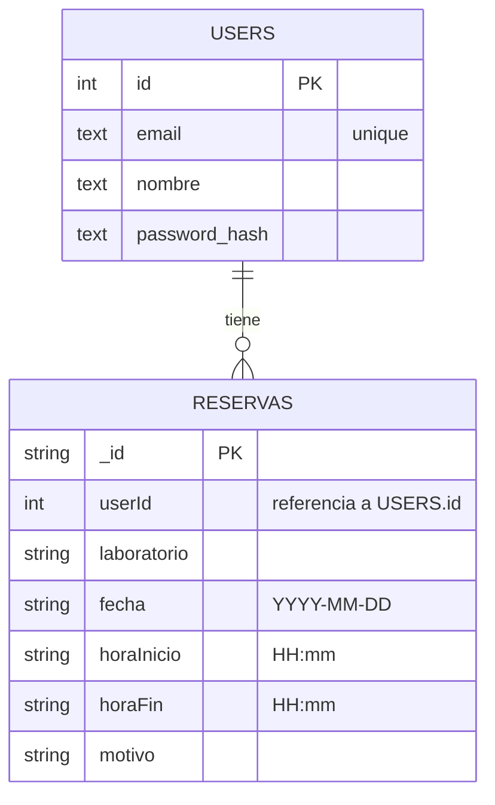

# Diagrama ER (simplificado)

Este proyecto usa:

- **Postgres** para usuarios
- **MongoDB** para reservas

Para cumplir el requisito de "diagramas de BD", aquí tienes un diagrama ER
en formato **Mermaid** (puedes pegarlo en herramientas compatibles o
en VS Code con extensión de Mermaid para exportar a imagen).

> Nota: la relación se materializa por `userId` dentro del documento de reserva.
